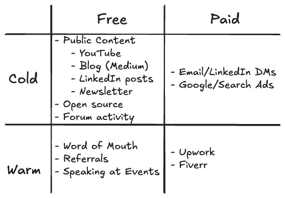

<!-- _class: lead -->
# The Plan
Transitioning from 9-5 salaryman to a business owner

---
# Knowledge is Power
> Ipsa scientia potestas est.
— <cite>Francis Bacon</cite>

> sed actus lucem fert.
— <cite>Richard Collins</cite>

---
# Agenda
- Update later...

---

# Outbound

---
# Why Leave the 9-5?
<!-- _header: "Why leave?" -->
<!-- _footer: "richardcollins128@gmail.com | the-plan" -->
- Burnout & limitations
- Desire for autonomy
- Long-term vision

---
# Mindset Shift
<!-- _header: "Mindset shift" -->
- From employee to entrepreneur
- Embracing risk & uncertainty
- Growth mindset

---
# Building Skills & Network
<!-- _header: "Skills & network" -->
- Identify gaps
- Learn business basics
- Find mentors & peers

---
# Side Hustles & Validation
<!-- _header: "Side hustles" -->
- Start small projects
- Test ideas
- Gather feedback

---
# Financial Runway
<!-- _header: "Financial runway" -->
- Save aggressively
- Reduce expenses
- Plan for 12-18 months

---
# Making the Leap
<!-- _header: "Making the leap" -->
- When to quit
- Transition plan
- First 90 days

---
# Surviving & Thriving
<!-- _header: "Survive & thrive" -->
- Iterate & adapt
- Build systems
- Celebrate wins

---
# Q&A
<!-- _header: "Q&A" -->
Ask me anything!

---
<!-- _footer: "Thanks for your attention! 🚀" -->
# Thank You!
Let's connect: richardcollins128@gmail.com
